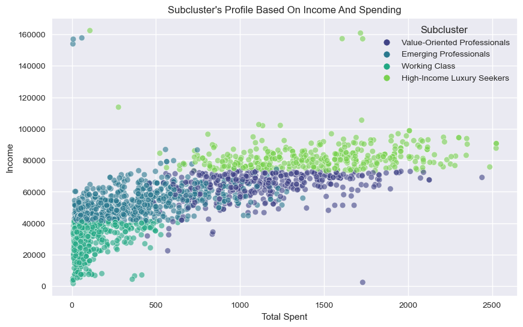
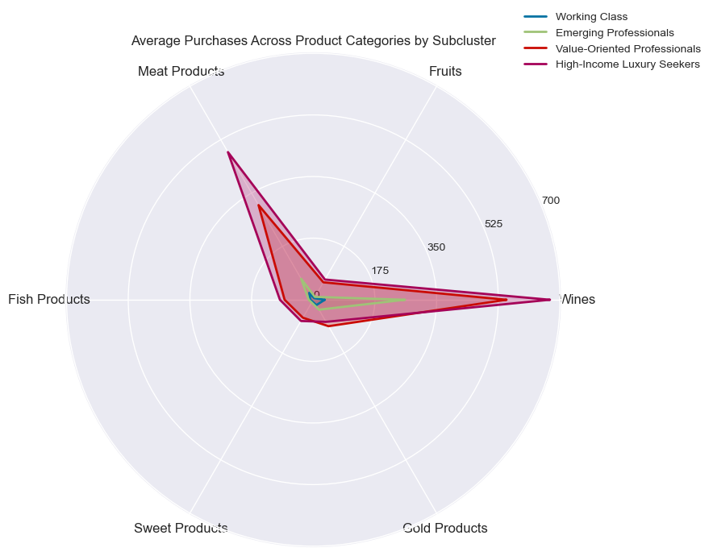
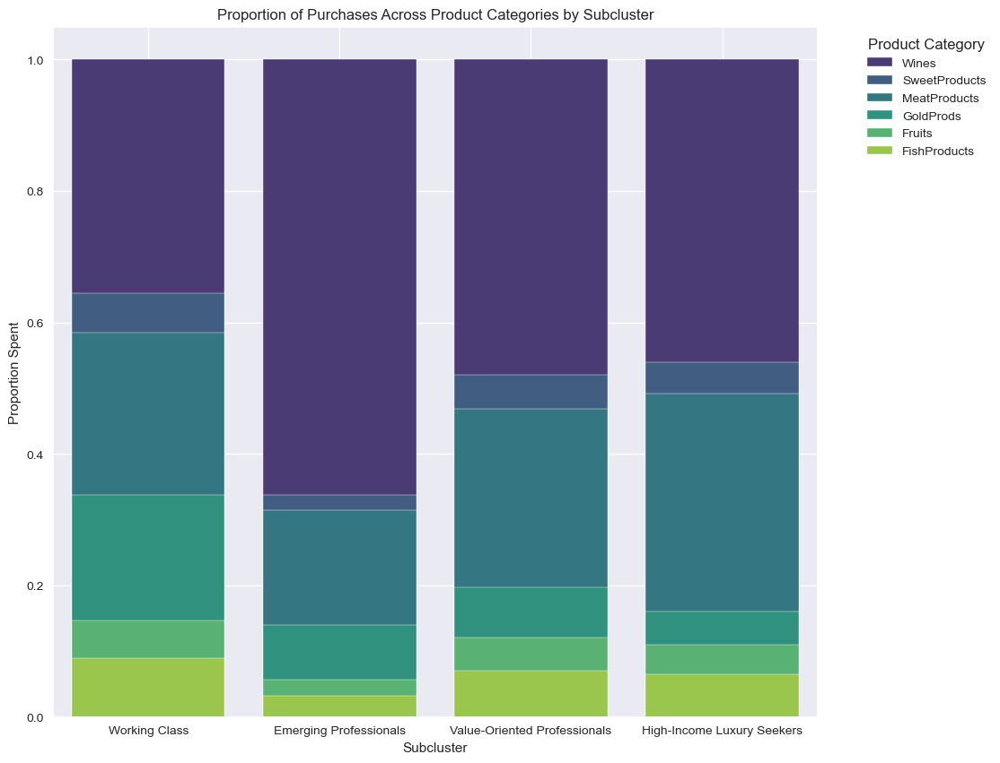
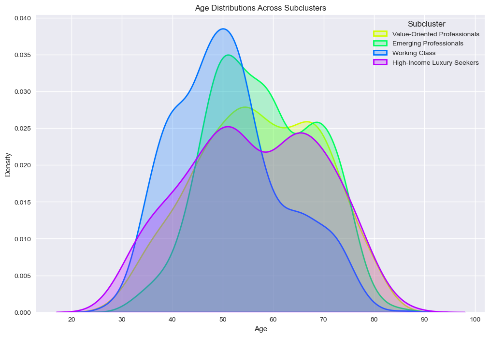
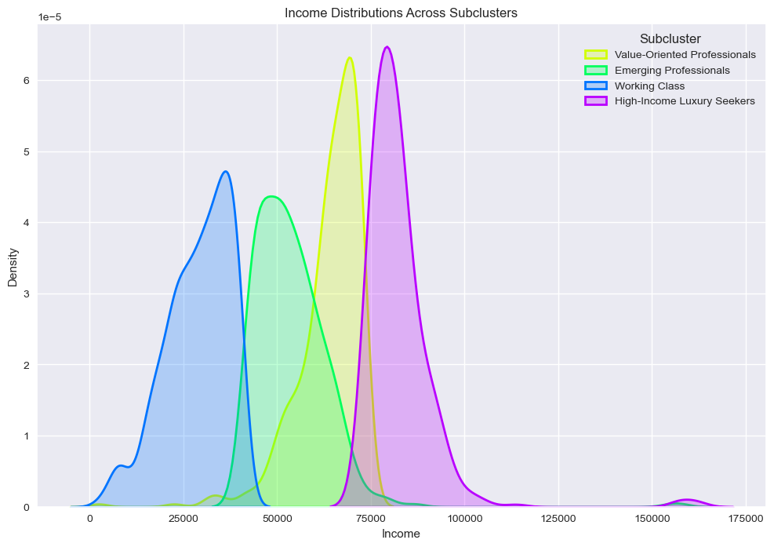
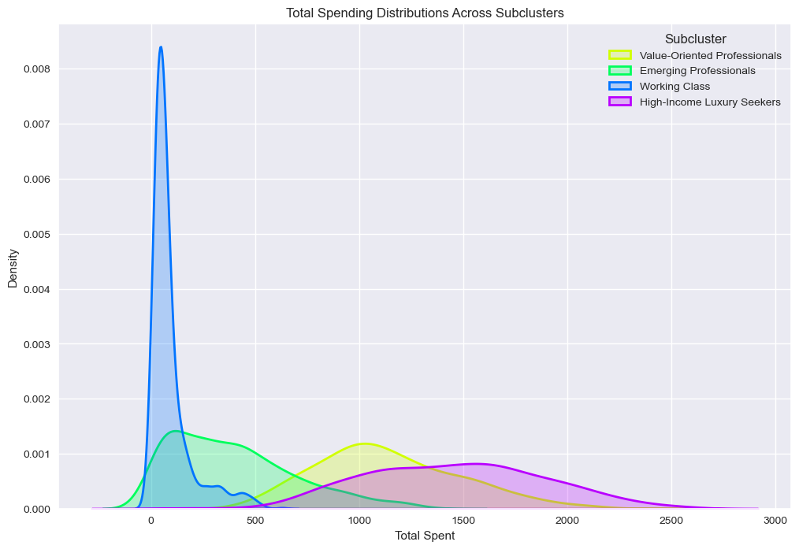
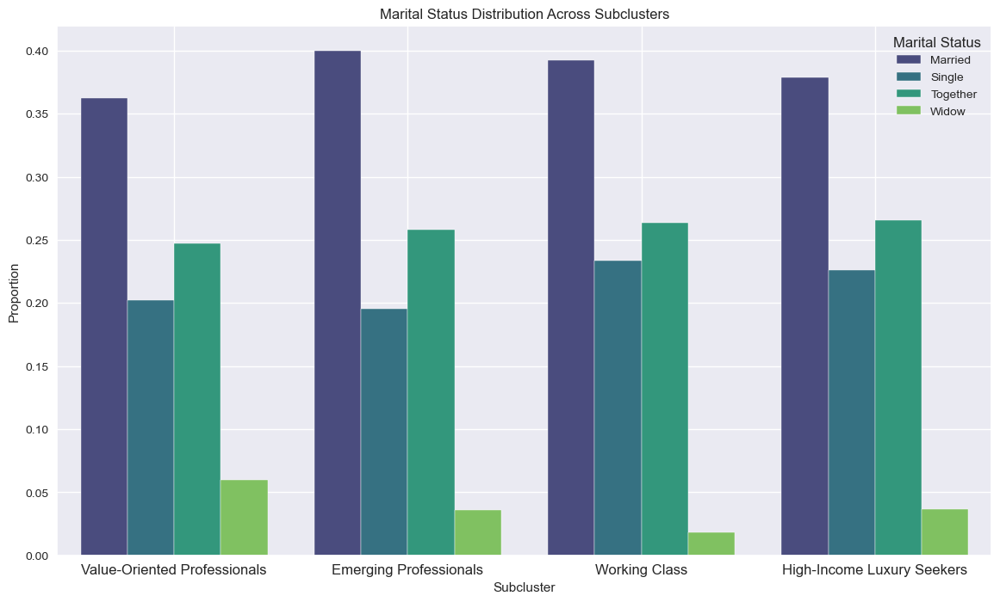

# Customer Segmentation Analysis

## Project Overview

This project focuses on customer segmentation using clustering techniques to identify distinct customer groups based on purchasing behaviors and demographics. The analysis is designed to provide insights into the different customer segments, helping businesses tailor marketing strategies and improve customer engagement.

## Objectives

1. **Identify Distinct Customer Segments**: Utilize clustering algorithms to group customers based on their purchasing patterns and demographic information.
2. **Profile Each Segment**: Provide detailed profiles for each identified segment, including spending habits, demographic details, and responsiveness to marketing campaigns.
3. **Visualize Segments**: Create visualizations to illustrate the characteristics and behaviors of each segment, facilitating easier understanding and decision-making.

## Data Sources

The dataset used for this project may be found [here](https://www.kaggle.com/datasets/imakash3011/customer-personality-analysis/data) and includes includes the following features:
- **Demographic Information**: Age, income, marital status, education level, and the number of children in the household.
- **Purchasing Behaviors**: Amount spent on different product categories (wines, fruits, meat products, fish products, sweet products, and gold products).
- **Marketing Interaction**: Number of web, catalog, and store purchases, and response to marketing campaigns.
- **Other Features**: Discount usage and complaint frequency.

## Methodology

1. **Data Preprocessing**: Cleaning the dataset, handling missing values, and standardizing numerical features.
2. **Clustering**: Implementing K-means clustering to identify customer segments. The optimal number of clusters was determined using the elbow method and silhouette analysis.
3. **Segmentation and Profiling**: Analyzing each cluster to create comprehensive profiles, including demographic and behavioral insights.
4. **Visualization**: Utilizing various visualization techniques such as radar charts, KDE plots, and bar charts to depict the characteristics of each segment.

## Segment Profiles

1. **Working Class**: Predominantly middle-aged individuals with moderate incomes, balanced spending, and a high proportion of married individuals.
2. **Emerging Professionals**: Younger adults, early in their careers, with lower incomes and spending, focused on essentials and discounts.
3. **Value-Oriented Professionals**: Higher-income individuals with careful budgeting and value-seeking behavior, balanced spending, and a moderate response to marketing.
4. **High-Income Luxury Seekers**: High-income, highly educated individuals, focused on luxury items, with significant spending across all categories.

## Visualizations

### Key Visualizations

#### Segmentation

#### Purchasing Behavior

#### Age Distribution

#### Income Distribution

#### Total Spending Distribution

#### Marital Status Distribution Across Subclusters

## Future Work

- **Incorporate Additional Data**: Integrate more features such as geographic location, customer feedback, and brand preferences.
- **Predictive Modeling**: Develop models to predict customer behaviors based on historical data.
- **Further Segmentation**: Explore more advanced clustering techniques to identify even more granular subsegments.

## How to Run the Project

1. **Dependencies**: Ensure you have the necessary Python libraries installed, such as pandas, numpy, matplotlib, seaborn, scikit-learn, and yellowbrick.
2. **Data Preparation**: Load and preprocess the dataset as described in the methodology.
3. **Clustering and Analysis**: Run the clustering algorithm and analyze the segments.
4. **Visualization**: Generate the visualizations to interpret and present the findings.

## Conclusion

This customer segmentation project provides valuable insights into customer behaviors, allowing businesses to tailor their strategies to different segments effectively. By understanding the unique characteristics of each segment, companies can optimize their marketing efforts, improve customer satisfaction, and drive growth.
